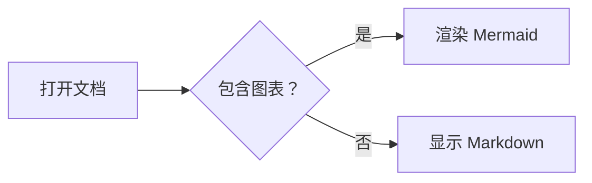
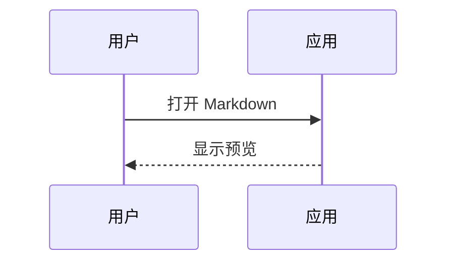

# Mermaid 示例

```mermaid
flowchart LR
 A[打开文档] --> B{包含图表？}
 B -->|是| C[渲染 Mermaid]
 B -->|否| D[显示 Markdown]
```

```mermaid
sequenceDiagram
 participant U as 用户
 participant A as 应用
 U->>A: 打开 Markdown
 A-->>U: 显示预览
```

```mermaid
this is invalid
```
